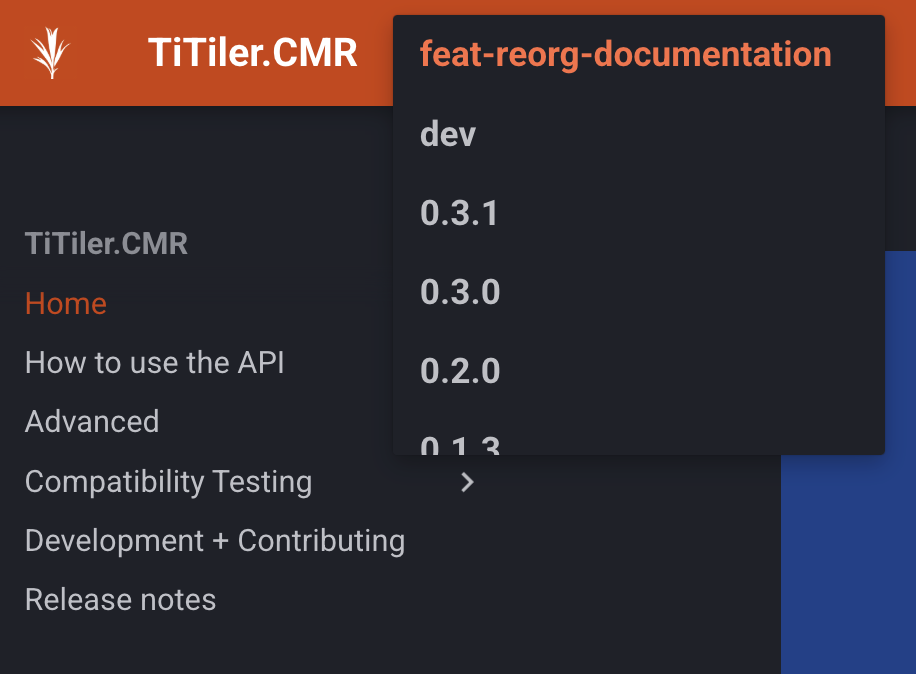

# Development - Contributing

Issues and pull requests are more than welcome: <https://github.com/developmentseed/titiler-cmr/issues>

**dev install**

This project uses [`uv`](https://docs.astral.sh/uv/) to manage the python environment and dependencies.
To install the package for development you can follow these steps:

```bash
# install uv

# unix
curl -LsSf https://astral.sh/uv/install.sh | sh

# or windows
# powershell -c "irm https://astral.sh/uv/install.ps1 | iex"

git clone https://github.com/developmentseed/titiler-cmr.git
cd titiler-cmr
uv sync --all-extras
```

## Linting

This repo is set to use `pre-commit` to run *isort*, *flake8*, *pydocstring*, *black* ("uncompromising Python code formatter") and mypy when committing new code.

```bash
uv run pre-commit install
```

## Testing

You can then run the tests with the following command:

```bash
uv run pytest
```

The tests use `vcrpy <https://vcrpy.readthedocs.io/en/latest/>`_ to mock API calls
with "pre-recorded" API responses. When adding new tests that incur actual network traffic,
use the ``@pytest.mark.vcr`` decorator function to indicate ``vcrpy`` should be used.
Record the new responses and commit them to the repository.

```bash
uv run pytest -v -s --record-mode new_episodes
```

## Documentation

The documentation is generated using `mkdocs` and gets built and deployed to Github Pages when new tags are released and on pushes to the `develop` branch.

To preview the documentation in your browser you can run:

```bash
uv run mkdocs serve -o
```

### Previewing documentation changes

To preview documentation changes on a specific branch, you can deploy a specific branch to the documentation site using Github Actions workflow dispatch. This will create a new "version" of the documentation which is discoverable in the documentation drop down.



This "version" of the documentation is really just a new directory of the documentation in the gh-pages branch of this repository. 

Remember to delete that branch when you are done:

```
uv run mike delete feat-reorg-documentation --push
```

This will:
1. Delete the feat-reorg-documentation version from the documentation
2. Push the changes to the gh-pages branch
