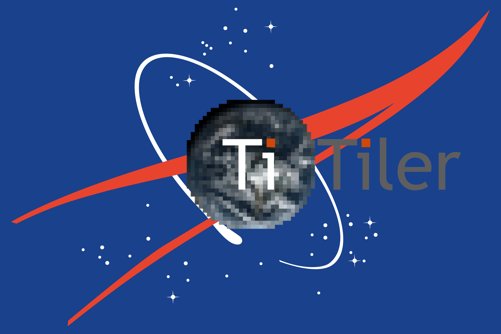

<p align="center">
  
  <p align="center">A modern dynamic tile server with a NASA CMR backend built on top of FastAPI and Rasterio/GDAL.</p>
</p>

<p align="center">
  <a href="https://github.com/developmentseed/titiler/actions?query=workflow%3ACI" target="_blank">
      
  </a>
  <a href="https://github.com/developmentseed/titiler-cmr/blob/main/LICENSE" target="_blank">
      
  </a>
</p>

# titiler-cmr

An API for creating image tiles from CMR queries.

## Features

- Render tiles from assets discovered via queries to [NASA's CMR](https://cmr.earthdata.nasa.gov/search)
- Uses the [`earthaccess` python package](https://github.com/nsidc/earthaccess) to query the CMR
- Built on top of [titiler](https://github.com/developmentseed/titiler)
- Multiple projections support (see [TileMatrixSets](https://www.ogc.org/standards/tms)) via [`morecantile`](https://github.com/developmentseed/morecantile).
- JPEG / JP2 / PNG / WEBP / GTIFF / NumpyTile output format support
- Automatic OpenAPI documentation (FastAPI builtin)
- Example of AWS Lambda / ECS deployment (via CDK)

## Installation

To install from sources and run for development:

```bash
git clone https://github.com/developmentseed/titiler-cmr.git
cd titiler-cmr

python -m pip install -U pip
python -m pip install uvicorn -e .[dev,test]
```

## Authentication for data read access

`titiler-cmr` can read data either over `HTTP` (external) or directly from `AWS S3` (direct) depending on the app configuration.
The behavior of the application is controlled by the S3 authentication settings in [`settings.py`](./titiler/cmr/settings.py), which you can set either with environment variables (`TITILER_CMR_S3_AUTH_ACCESS`, `TITILER_CMR_S3_AUTH_STRATEGY`) or in an environment file (`.env`).

### Direct from S3

When running in an AWS context (e.g. Lambda), you should configure the application to access the data directly from `S3`.
You can do this in two ways:

- Configure an AWS IAM role for your runtime environment that has read access to the NASA buckets so that `rasterio/GDAL` can find the AWS credentials when reading data
- Set the `EARTHDATA_USERNAME` and `EARTHDATA_PASSWORD` environment variables so that the `earthaccess` package can issue temporary AWS credentials

> [!NOTE]
> Direct S3 access configuration will only work if the application is running in the same AWS region as the data are stored!

### External access

When running outside of the AWS context (e.g. locally) you will need to configure the application to access data over `HTTP`.
You can do this by creating an Earthdata account, configuring your `.netrc` file with your Earthdata login credentials (which GDAL will find when trying to access data over the network), and setting a few environment variables:

```bash
# environment variables for GDAL to read data from NASA over HTTP
export GDAL_DISABLE_READDIR_ON_OPEN=YES
export CPL_VSIL_CURL_USE_HEAD=FALSE
export GDAL_HTTP_COOKIEFILE=/tmp/cookies.txt
export GDAL_HTTP_COOKIEJAR=/tmp/cookies.txt
export EARTHDATA_USERNAME={your earthdata username}
export EARTHDATA_PASSWORD={your earthdata password}

# write your .netrc file to the home directory
echo "machine urs.earthdata.nasa.gov login ${EARTHDATA_USERNAME} password ${EARTHDATA_PASSWORD}" > ~/.netrc
```

> [!NOTE]
> See [NASA's docs](https://uat.urs.earthdata.nasa.gov/documentation/for_users/data_access/curl_and_wget) for details

## Docker deployment

You can run the application in a docker container using the [docker-compose.yml](./docker-compose.yml).
The docker container is configured to read the `EARTHDATA_USERNAME` and `EARTHDATA_PASSWORD` environment variables so make sure set those before starting the docker network.

```bash
docker compose up --build 
```

The application will be available at this address: [http://localhost:8081/api.html](http://localhost:8081/api.html)

## Local deployment

To run the application directly in your local environment, configure the application to access data over `HTTP` then run it using `uvicorn`:

```bash
TITILER_CMR_S3_AUTH_ACCESS=external uvicorn titiler.cmr.main:app --reload
```

The application will be available at this address: [http://localhost:8000/api.html](http://localhost:8000/api.html)

## Contribution & Development

See [CONTRIBUTING.md](https://github.com/developmentseed/titiler-cmr/blob/develop/CONTRIBUTING.md)

## License

See [LICENSE](https://github.com/developmentseed/titiler-cmr/blob/develop/LICENSE)

## Authors

Created by [Development Seed](<http://developmentseed.org>)

See [contributors](https://github.com/developmentseed/titiler-cmr/graphs/contributors) for a listing of individual contributors.

## Changes

See [CHANGES.md](https://github.com/developmentseed/titiler-cmr/blob/main/CHANGES.md).
